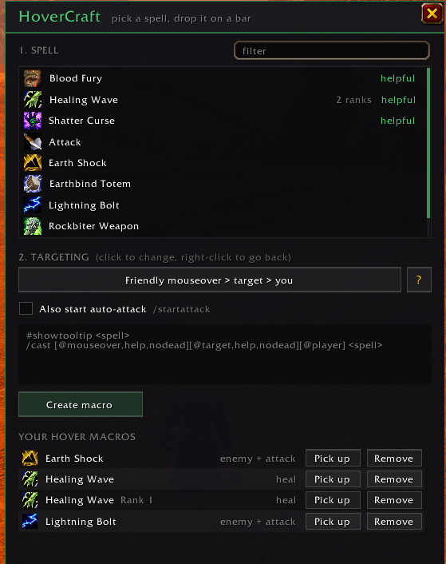

# HoverCraft

Mouseover macros for **WoW: Forever**, without typing them. Pick a spell, pick how it should
target, click **Create macro**, and the macro lands on your cursor, ready to drop onto an action bar.



With the default targeting it writes this for you:

```
#showtooltip Flash of Light
/cast [@mouseover,help,nodead][@target,help,nodead][@player] Flash of Light
```

Heal whoever your mouse is over; with nobody friendly under the mouse, heal your target; with no
friendly target, heal yourself.

## Features

- **Six targeting options.** The `?` button next to them explains each one in plain words.
- **Tank healing.** Target the boss and the heal goes to whoever the boss is hitting. Mouse over
  anyone else to heal them instead.
- **Spell ranks.** Spells with more than one rank ask which one you want. **Max rank** leaves the
  rank off, so the macro always casts your highest, including ranks you train later. A specific
  rank is written the way the spellbook writes it: `Holy Light(Rank 1)`.
- **Start auto-attack.** A checkbox adds `/startattack [harm,nodead]` above the cast. It only fires
  when your target is a live enemy, so heals stay error-free: heal a mouseover and keep swinging
  at the boss.
- **Targeting follows the spell.** Pick a damage spell and the targeting switches to enemy; pick a
  heal and it switches back.
- **Your hover macros.** Every macro HoverCraft made, with its targeting. **Pick up** puts it back on
  your cursor (for a second bar), **Remove** deletes it, and clicking the row loads it back into the
  editor so you can change it.

### Targeting options

| Option | Conditions it writes | Good for |
|---|---|---|
| Friendly mouseover > target > you | `[@mouseover,help,nodead][@target,help,nodead][@player]` | most heals and buffs |
| Mouseover > target > boss's target (tank) > you | `[@mouseover,help,nodead][@target,help,nodead][@targettarget,help,nodead][@player]` | tank healing |
| Friendly mouseover > target | `[@mouseover,help,nodead][]` | buffs you aim yourself |
| Any mouseover > target | `[@mouseover,exists,nodead][]` | dispels that work on friends and enemies |
| Enemy mouseover > target | `[@mouseover,harm,nodead][]` | damage spells, DoTs, interrupts |
| Dead friendly mouseover > target | `[@mouseover,help,dead][]` | resurrect spells |

### Why not Blizzard's Mouseover Cast setting?

Forever has Blizzard's **Mouseover Cast** option in the combat settings. It turns every action
button into "mouseover, otherwise target". HoverCraft's macros are per spell, and they can fall
back to you, heal the boss's target, stay enemy-only or dead-only, pin a rank, and start
auto-attack. The two work fine together.

## Install

1. Download `HoverCraft-x.y.z.zip` from the [Releases page](https://github.com/taubut/HoverCraft/releases/latest).
2. Extract it. You get a `HoverCraft` folder, ready to go.
3. Move that folder into your AddOns directory. For the Forever beta that is
   `World of Warcraft/_classic_beta_/Interface/AddOns/`.
4. You should end up with `.../AddOns/HoverCraft/HoverCraft.toc`. Restart the game or `/reload`.

If you use GitHub's green **Code → Download ZIP** button instead, the folder comes out as
`HoverCraft-main` and you have to rename it to `HoverCraft` yourself.

The addon has no dependencies.

## Using it

1. Type `/hover`, or open it from the addon menu by the minimap.
2. Click a spell. The filter box narrows the list.
3. Click the targeting button until it shows the option you want (right-click goes back).
4. Tick **Also start auto-attack** if you want it.
5. Click **Create macro**. If the spell has ranks, pick **Max rank** or a specific one.
6. The macro is on your cursor: click an action bar slot to place it, then bind that slot to a key
   the way you normally would.

Macros can't be created or changed in combat. That's a game rule, and HoverCraft tells you when it
happens.

### Slash commands

| Command | What it does |
|---|---|
| `/hover` | Open or close the window |
| `/hover Flash of Light` | Make that macro with the default targeting and put it on your cursor |
| `/hover Holy Light(Rank 1)` | Same, for a specific rank |

`/hovercraft` works as well if `/hover` collides with another addon.

## Good to know

- **Nothing is stored.** HoverCraft has no saved settings. The macros are ordinary
  character-specific macros, so they keep working if you disable or delete the addon. HoverCraft
  finds its own by their name (`HC <spell>`) and the `@mouseover` in their text.
- **Macro names.** The game caps macro names at 16 characters: `HC Holy Light`,
  `HC Holy Light r1` for a rank, initials like `HC GBoK` when a long name won't fit or is taken,
  then `HC BoS2`. HoverCraft never overwrites a macro that belongs to a different spell or one you
  wrote yourself.
- **Macro slots.** New macros go in your character-specific macro slots. If those are full,
  HoverCraft says so.
- **Classic Era and TBC Anniversary** aren't supported. Their spellbook API is different, so the
  spell list would come up empty.

## License

MIT. See [LICENSE](LICENSE).
